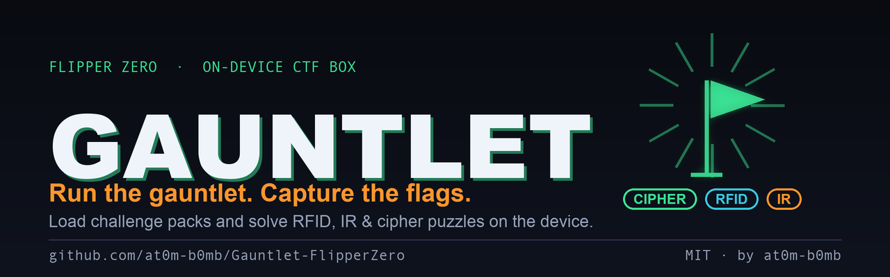
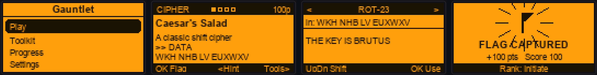
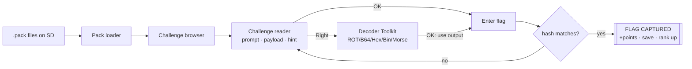

<div align="center">



# Gauntlet

**An on-device Capture-The-Flag box for your Flipper Zero.**

Load challenge packs from the SD card and solve **RFID**, **infrared** and **cipher** puzzles right on the device — no laptop in the room. A built-in decoder **Toolkit** cracks ciphers on-screen, flags are checked against a hash so answers stay secret, and your score, rank and solved count are saved across sessions.

[](https://github.com/at0m-b0mb/Gauntlet-FlipperZero/actions/workflows/build.yml)


-8a2be2)


</div>

---

## What it is

**Gauntlet turns your Flipper into a self-contained CTF arcade.** Drop a challenge pack — a plain-text `.pack` file — onto the SD card and the app becomes a menu of puzzles to solve on the device: decode a captured infrared frame, extract a facility code from a Wiegand badge dump, break a Caesar cipher. Enter the flag, watch it get captured, climb the ranks.

It's built for **workshops, classrooms and CTF practice** where handing everyone a laptop isn't practical — the challenges *and* the tools to solve them both live on the Flipper.

<div align="center">



*Main menu · a challenge · the Toolkit cracking a cipher · flag captured*

</div>

---

## Highlights

- 🚩 **Load challenge packs** — human-readable `.pack` files you can author in any text editor and share.
- 🧰 **Built-in decoder Toolkit** — ROT/Caesar (all 25 shifts), Base64, Hex, Binary, Morse, Atbash and Reverse. Crack cipher tasks on-screen with zero external tools.
- 🔐 **Hashed flags** — answers are stored as a hash, so a solver reading the `.pack` file still can't read the solution.
- 🏆 **Score, ranks & persistence** — every solve is saved to the SD card. Earn points, rise from **Rookie** to **Legend**.
- 💡 **Hints** — optional per-challenge hints, with an optional points penalty you control.
- 🎨 **A UI made for it** — category-tagged headers, difficulty pips, a scrollable challenge reader, a decoder carousel and an animated *flag captured* celebration.
- 📦 **Playable out of the box** — a starter pack is written to your SD card on first run.
- 🛡️ **No extra hardware** — pure software; nothing to wire up.

---

## Challenge categories

| | Category | Example challenges |
|:---:|---|---|
| 🔡 | **Cipher** | Caesar / ROT, Base64, hex, binary, Morse, Atbash — solvable with the Toolkit |
| 💳 | **RFID** | decode a card data block, pull a facility code out of a 26-bit Wiegand read |
| 📡 | **Infrared** | read a value out of a captured NEC frame, decode a hidden remote label |
| 📻 | **Sub-GHz** | radio-flavoured decode puzzles |
| 🧩 | **Misc** | warmups and logic puzzles |

The starter pack ships a tour across all of them.

---

## How it works



Each challenge names a **category**, **points**, a **difficulty**, a **prompt**, an optional **payload** (`DATA`) and a **hint**. You read it, work it — with the Toolkit if it's a cipher — then submit a flag. Gauntlet normalises your answer (trims spaces, case-insensitive unless the challenge is marked `EXACT`), hashes it, and compares against the stored hash. Match → the flag is captured, points are banked and saved.

---

## The Toolkit

Open it from any challenge (**Right**) pre-loaded with that challenge's payload, or from the main menu on free text. Flip decoders with **← →**, and for ROT dial the shift with **↑ ↓** and watch the plaintext fall into place. Press **OK** to drop the current output straight into the flag box.

| Decoder | Does |
|---|---|
| **ROT-N / Caesar** | shifts the alphabet; step through all 25 |
| **Base64** | decodes Base64 text |
| **Hex → Text** | hex byte pairs to ASCII |
| **Binary → Text** | 8-bit groups to ASCII |
| **Morse → Text** | `.` `-` and `/` to letters |
| **Atbash** | mirrors the alphabet (A↔Z) |
| **Reverse** | reverses the string |

---

## Install

### Option A — qFlipper (easiest)

1. Download `gauntlet.fap` from the [latest release](https://github.com/at0m-b0mb/Gauntlet-FlipperZero/releases) (or build it, below).
2. Open **qFlipper** and connect your Flipper Zero.
3. Drag `gauntlet.fap` into **SD Card → `apps` → `Games`**.
4. On the Flipper: **Apps → Games → Gauntlet**.

The first launch writes a starter pack to `apps_data/gauntlet/packs/` so there's something to play immediately.

### Option B — Build & launch with ufbt

```bash
python3 -m pip install --upgrade ufbt      # one-time
git clone https://github.com/at0m-b0mb/Gauntlet-FlipperZero.git
cd Gauntlet-FlipperZero
ufbt                                        # builds dist/gauntlet.fap
ufbt launch                                 # installs + opens it on a connected Flipper
```

### Option C — Manual SD card

Copy `dist/gauntlet.fap` to `apps/Games/` on the Flipper's microSD, then open it from **Apps → Games → Gauntlet**.

---

## Using it

1. **Play** → pick a **pack** → pick a **challenge**.
2. Read the prompt and payload. Scroll with **↑ ↓**. Stuck? Press **Left** for the hint.
3. If it's a cipher, press **Right** to open the **Toolkit** on the payload, decode it, and press **OK** to send the result to the flag box.
4. Press **OK** on the challenge to type a flag. Get it right and the flag is **captured** — points banked, progress saved.
5. Check **Progress** from the main menu for your score, rank and flags captured.

**Controls in a challenge:** `OK` enter flag · `Right` Toolkit · `Left` hint · `Up/Down` scroll · `Back` list.
**Controls in the Toolkit:** `Left/Right` decoder · `Up/Down` scroll (or ROT shift) · `OK` use output as flag.

---

## Make your own packs

A pack is a plain-text file ending in `.pack`, dropped in:

```
SD:/apps_data/gauntlet/packs/
```

It's line-based — one `KEY value` per line. A `CHALLENGE` line starts a new challenge; the keys under it describe it until the next `CHALLENGE`.

```text
PACK    My Workshop
AUTHOR  you
DESC    A short description of the pack

CHALLENGE Caesar's Secret
CATEGORY  cipher              # cipher | rfid | ir | radio | misc
POINTS    100
DIFFICULTY easy               # easy | medium | hard | insane
PROMPT    Julius left a note. Roll it back and submit the name.
DATA      WKH QDPH LV FDHVDU
HINT      Every letter moved by 3. Try the Toolkit's ROT.
FLAG      caesar
```

**Keys:** `PACK`, `AUTHOR`, `DESC` (pack-level) · `CHALLENGE`, `CATEGORY`, `POINTS`, `DIFFICULTY`, `PROMPT`, `DATA`, `HINT`, `FLAG`/`ANSWER`, `EXACT` (per challenge). `PROMPT` and `DATA` may repeat to add lines. Lines starting with `#` are comments.

### Keeping answers secret

`FLAG plaintext` is the easy path — Gauntlet hashes it at load. But a curious solver could open the file and read it. Instead ship a **precomputed hash** so the answer never appears in the pack:

```text
ANSWER a1b2c3d4          # FNV-1a 32-bit of the normalised flag
```

Generate hashes (and a ready-to-use starter pack) with the included tool:

```bash
python3 tools_gen_pack.py   # prints each challenge's ANSWER hash
```

Add `EXACT` to a challenge to make its flag case-sensitive. See [`packs/starter.pack`](packs/starter.pack) for a complete, working example.

---

## Safety, ethics & legal

- **For learning and authorised practice.** Gauntlet ships no attacks — it reads packs and decodes text. Solve only packs you own or were given.
- **No hardware, no transmitting.** It's a puzzle box: file parsing, string decoders and a score file. Nothing is broadcast, cloned or written to any card or remote.
- Run your own workshops, CTF villages and classes with it — that's exactly what it's for.

---

## Build from source

Requires [ufbt](https://pypi.org/project/ufbt/). Assets and the starter pack are regenerated with Python + Pillow.

```bash
ufbt                          # build dist/gauntlet.fap
python3 tools_gen_pack.py     # starter.pack + embedded ctf_starter.h
python3 tools_gen_icons.py    # 10px app icon
python3 tools_gen_banner.py   # README banner + social preview
python3 tools_gen_mockups.py  # screen mockups
```

```
Gauntlet-FlipperZero/
├── application.fam            # app manifest (Games)
├── gauntlet.c / gauntlet_i.h  # app lifecycle + state
├── helpers/
│   ├── ctf_codec.c/.h         # the decoder Toolkit (pure)
│   ├── ctf_pack.c/.h          # pack model + parser + flag hashing (pure)
│   ├── ctf_store.c/.h         # SD-card I/O, progress, first-run starter
│   └── ctf_starter.h          # generated: embedded starter pack
├── views/
│   ├── challenge_view.c/.h    # the challenge reader
│   ├── toolkit_view.c/.h      # the decoder carousel
│   └── result_view.c/.h       # the "flag captured" celebration
├── scenes/                    # start · packs · browse · challenge · solve ·
│                              # result · toolkit · toolinput · progress ·
│                              # settings · about
└── packs/starter.pack         # a playable tour of every category
```

---

<div align="center">

**Gauntlet** · by [at0m-b0mb](https://github.com/at0m-b0mb) · MIT License

*Run the gauntlet. Capture the flags.*

</div>
